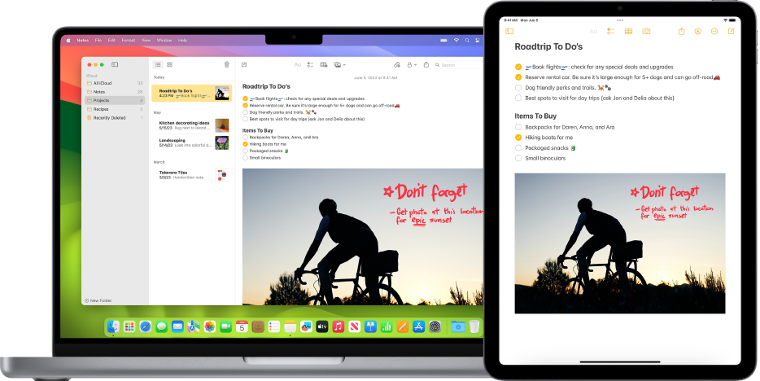
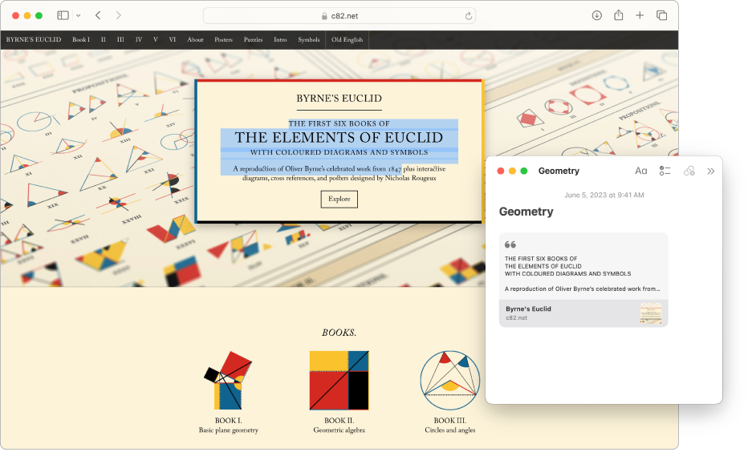
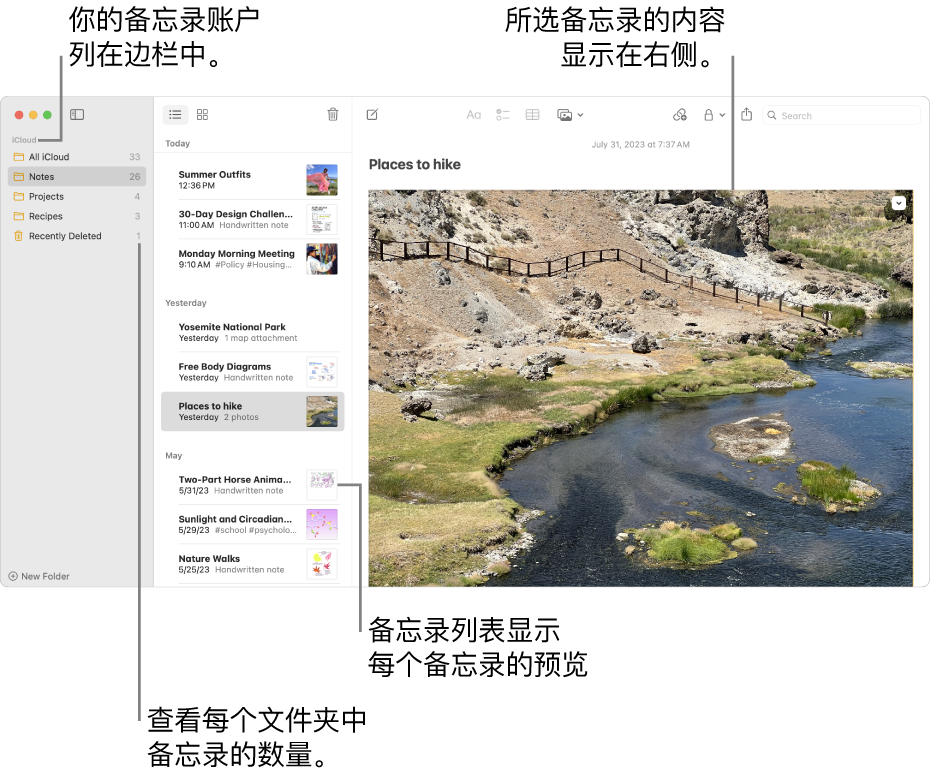
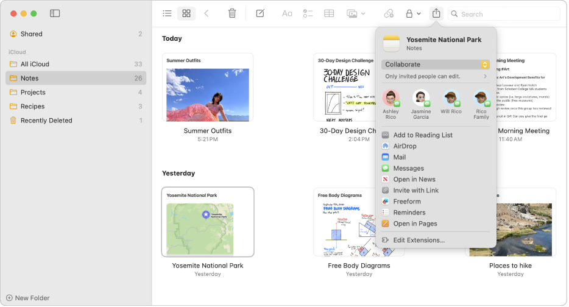

# Notes-备忘录

备忘录，我主要是用来收集信息和实时记录，得益于原生应用，有多种方式唤出备忘录记录信息，同时 iCloud 云同步，可以几乎无感的在 iOS、iPadOS、MacOS 中切换。

原生备忘录，几乎没有学习成本，新建文件后，直接编写即可，它属于类似 Word 的文本编辑器，该有的功能都有。支持图片、PDF、扫描、双向链接等。常规比较软件该有的功能，原生备忘录基本都有，而且原生的支持，有更多的易用性，比如 MacBook 可以设置备忘录触发角。

- Notes 是什么
- Notes 能做什么
- 如何使用 Notes
- 我的 Notes 使用心得

# Notes 是什么

Notes 是 Apple 的原生备忘录，是一款用于记录和管理备忘内容的软件，常规笔记软件有的功能，备忘录都有，且原生支持 iCloud 云同步。

# Notes 能做什么

随时随地，呼出备忘录，记录灵感、想法、笔记。

下图是 MacBook 的触发角：

# Notes 如何使用

Notes 是一款极其简单的应用，几乎没有学习成本，一上手就能使用。

以 MacBook 的备忘录为例，简单介绍 Notes 如何使用。MacBook 里的备忘录采用了苹果经典的三栏布局。编辑器是非常易用的类 Word 编辑，可以直观选择文字样式。

原生备忘录非常强大的一个功能就是——协作。将备忘录分享给需要协作的人员，即可共同编辑同一个备忘录。

# 我的 Notes 使用心得

原生备忘录是我使用频率非常高的应用，得益于它是 Apple 原生的应用，对系统和 iCloud 的同步优化，以及隐私安全性相对高，我可以用它记录日志等隐私性较高的内容，这些内容平常我是不太会写在云笔记软件，即便是我使用频率最高的幕布，也不会将隐私较高的内容写在上面。毕竟谁都不能保证这些云笔记软件的隐私安全性。而苹果的原生备忘录，通过 iCloud 云同步，安全性相对来说好了很多倍，与我而言足够了。要追求极致的安全，那就拔网线，显然不科学，只要入网隐私必然没有百分比的安全，但博主依旧要追求相对的安全，而苹果的原生备忘录就恰到好处。

原生备忘录，几乎没有学习成本，新建文件后，直接编写即可，它属于类似 Word 的文本编辑器，该有的功能都有。支持图片、PDF、扫描、双向链接等。常规比较软件该有的功能，原生备忘录基本都有，而且原生的支持，有更多的易用性，比如 MacBook 可以设置备忘录触发角。