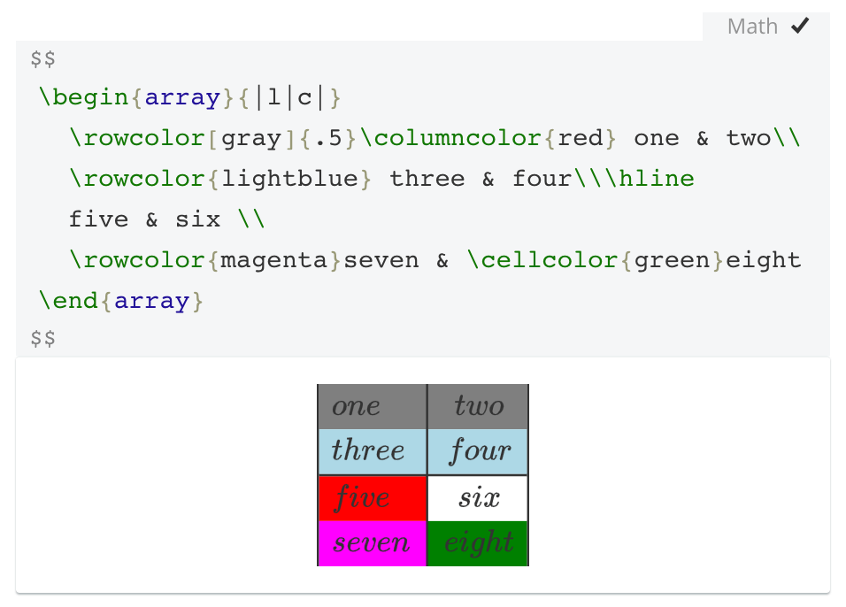
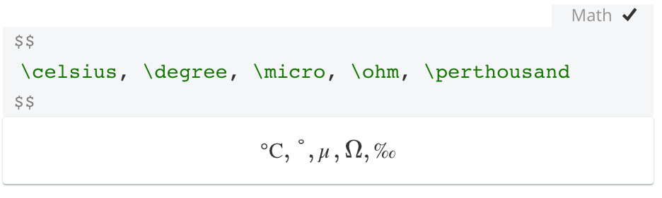
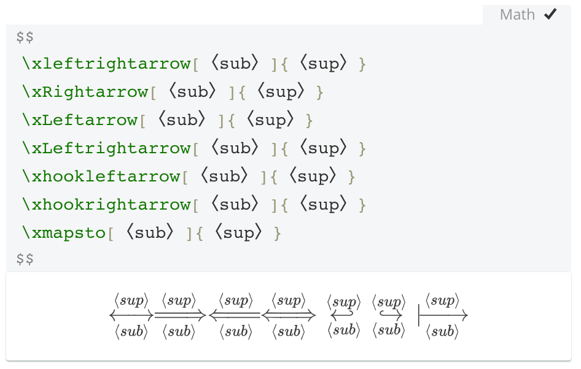
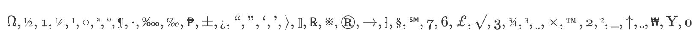
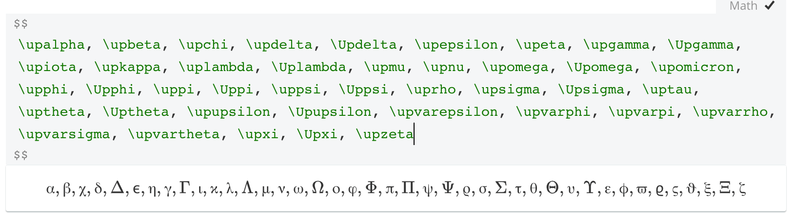
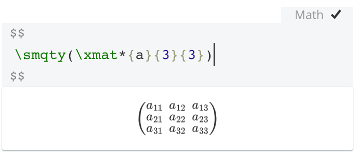
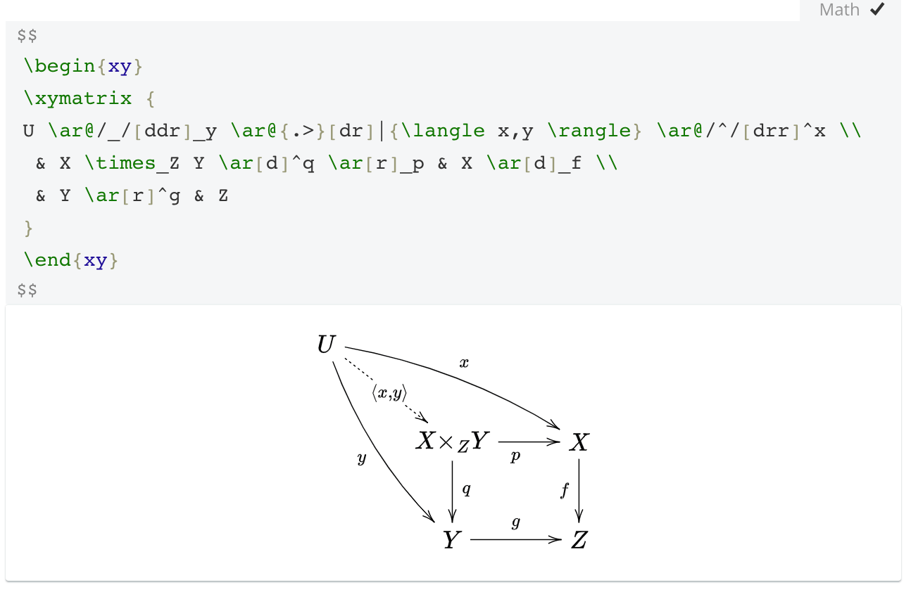

# LaTeX 数学公式-Typora 支持-MathJax

与以前的版本相比，支持以下 TeX 包：

- [cases](https://www.ctan.org/pkg/cases) — 为单独编号的案例提供环境

- [centernot](https://www.ctan.org/pkg/centernot) — 实现居中非命令（以及将一个符号置于另一个符号上方中心的非标准 centerOver）。

- [colortbl](http://docs.mathjax.org/en/latest/input/tex/extensions/colortbl.html#tex-colortbl) — 提供用于对数组或对齐的单元格进行着色的宏。注意：MathJax 目前没有实现任何用于设置或着色表格边界的命令。

    

- [empheq](http://docs.mathjax.org/en/latest/input/tex/extensions/empheq.html#tex-empheq) — 用于将材料放置在具有单独方程编号的对齐的左侧或右侧的环境。

- [gensymb](http://docs.mathjax.org/en/latest/input/tex/extensions/gensymb.html#tex-gensymb) — 为一些特定单元提供宏。

    

- [mathtools——](https://www.ctan.org/pkg/mathtools)提供一系列用于高级数学排版的宏和环境。

    

- [textcomp](http://docs.mathjax.org/en/latest/input/tex/extensions/textcomp.html#tex-textcomp) — 提供一系列用于指定各种文本字符的宏。

    

- [upgreek](http://docs.mathjax.org/en/latest/input/tex/extensions/upgreek.html#tex-upgreek) — 为直立希腊字符提供宏。

    

- brackett — brackett 扩展定义了以下宏，用于生成量子力学中使用的[bra-ket 符号和集合符号](https://en.wikipedia.org/wiki/Bra–ket_notation)

- 物理学——物理扩展实现了 LaTeX[物理包的](https://ctan.org/pkg/physics?lang=en)大部分功能。

    

- [xypic](https://github.com/sonoisa/XyJax-v3) — 绘制各种图形和图表。

    