# Mermaid

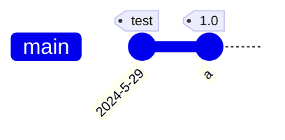

#### 前置依赖

> - Markdown：

##### 环境信息

> - MacOS 14
> - Typora 1.8 测试本文所有 Mermaid 代码
> - 适应：所有需要学习 Mermaid 的网友

###### 目录

> - Mermaid 简介
> - 流程图
> - 状态图
> - 序列图
> - Git 图
> - 用户旅程图
> - 思维导图
> - 类图
> - 时间线
> - ER图
> - 桑基图
> - 饼图
> - XY 图


关于 Typora 支持不好？

文字内容显示不全-自动撑开盒子的不行🚫

- 原因：偏好设置缩放了编辑器
- 解决：显示-实际大小（这点体验没有优化好）

- 流程图
- 状态图

## Mermaid 简介

它是一个基于 JavaScript 的图表绘制工具，可渲染 Markdown 启发的文本定义以动态创建和修改图表。

Mermaid 是一个基于 JavaScript 的图表绘制工具，它使用 Markdown 启发的文本定义和渲染器来创建和修改复杂的图表。Mermaid 的主要目的是帮助文档跟上开发的步伐。

相关内容：

- Mermaid 官网：https://mermaid.js.org/
- Mermaid 中文网：https://mermaid.nodejs.cn/

## 流程图

流程图由节点（几何形状）和边（箭头或线条）组成。Mermaid 代码定义了如何制作节点和边，并适应不同的箭头类型、多方向箭头以及任何与子图的链接。

- 节点
- 边
- 嵌套
- 注意符号
- 设置样式


### 节点 Node

- 定义流程图：`flowchart`
- 方向
    - `TB`、`TD`：上到下
    - `BT`：下到上
    - `LR`：左到右
    - `RL`：右到左
- 使用双引号和反引号 "`text`" 将 Markdown 文本括起来（Typora 似乎无用）

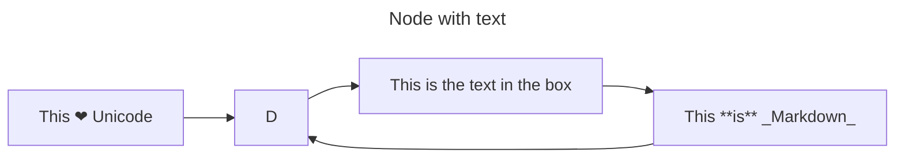

#### 节点形状（括号间形状的组合）

- **圆边**-小括号
    - `ep1(1. Lost Rainy Days, I Long to Be Soaked Once More)`
- **大圆边**-小括号嵌中括号
    - `ep2([2. I Like It When You Frown and Call Me Coward])`
- 子程序-中括号嵌中括号
    - `ep3[[3. Can You Come a Bit Closer?]]`
- 圆柱-中括号嵌小括号
    - `ep4[(4. Watch When We Started Getting Closer.)]`
- **圆形**-小括号嵌小括号
    - `ep5((5. Those Moments I Have Never Regretted))`
- 不对称形状-左小于号，右中括号
    - `ep6>6. When Susu Meets Susu]`
- **菱形**-大括号
    - `ep7{7. Good Job, I'll Reward You With Ten Points}`
- 六边形-大括号嵌大括号
    - `ep8{{8. Hey, My Prince}}`
- 平行四边形-中括号嵌斜线或反斜线
    - `ep9[/9. You Are More Charming Than the Scenery/]`
- 梯形-中括号嵌斜线和反斜线
    - `ep10[/10. On Doomsday, I Want to Tell You That...\]`
- 双圆-三个小括号
    - `ep11(((11. Happy New Year, Rangrang)))`

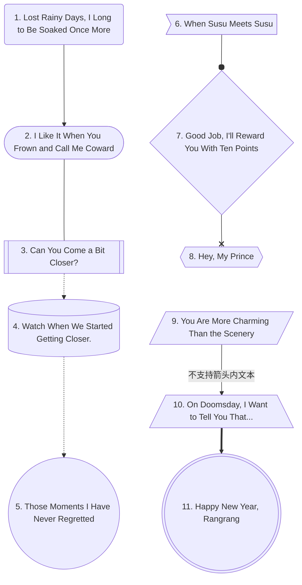

### 边

- 箭头：`-->`
- 横向：`---`
- 虚线：`-.->`、`-...->`
- 粗箭头：`==>`
- 圆边：`--o`
- 交叉边缘：`--x`
- 不可见边：`A ~~~ B`
    - 在某些你想要更改节点的默认位置的情况下，这可能是一个有用的工具。

- 边上加文字（采用中间加文字时，右边横杆要多于左边）
    - Typora 不支持，中间加文字
    - `-- text --->`
    - `-->|text|`
    - `-- This is the text! ---`
    - `---|This is the text!|`
    - `-. text .-->`
    - `== text ===>`
    
- 多个
    - 可以在同一行中声明多个链接：`A -- text --> B -- text2 --> C`
    - 还可以在同一行中声明多个节点链接：`a --> b & c--> d`
    - 箭头指向可以双向，只需在左边也写上对应标志
    - `-` 的数量决定了边的长度（默认最小长度—能链接到目标的最短距离）

### 破坏语法规则的情况及解决

- 文本内容有括号或有转义字符
    - `“This is the (text) in the box”`
    - `A["A double quote:#quot;"] --> B["A dec char:#9829;"]`
- Typora 不支持mermaid 内部 Markdown 渲染

### 子图

嵌套如下代码结构：

```
subgraph one
    direction RL
    a1-->a2
    end
```


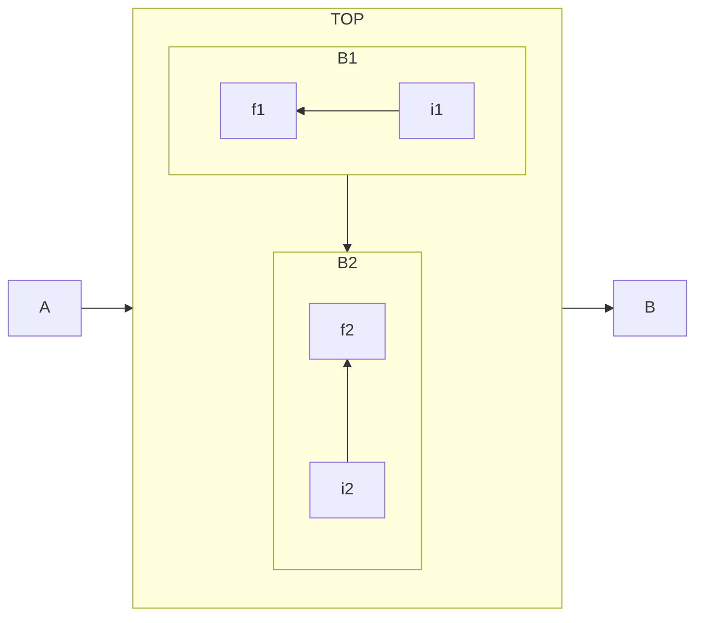


### 点击事件

- `click C href "https://www.github.com" _blank`

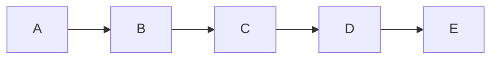

### 样式

- 定义：`classDef someclass fill:#f96`
- 调用：`A:::someclass --> B`

- 一般只会更改背景颜色 `fill:xxx` 和边框颜色 `stroke:xxx`

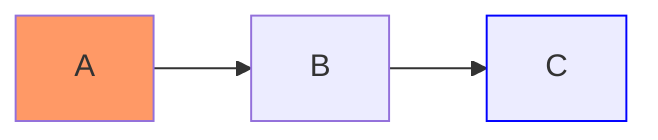


## 状态图

> 状态图就是流程图的一个“继承类实例”，对于状态变化，比流程图更具有针对性。

- 定义状态图：`stateDiagram-v2`

- 状态（类似节点）
- 过渡（只有箭头→）
- 复合状态（嵌套、分组）
- 文字注意

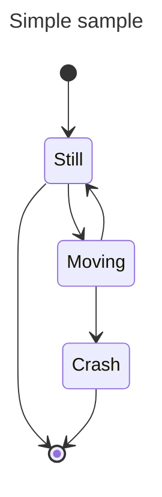


## 序列图

- 定义序列图：`sequenceDiagram`
- 角色
- 发消息
- 装饰


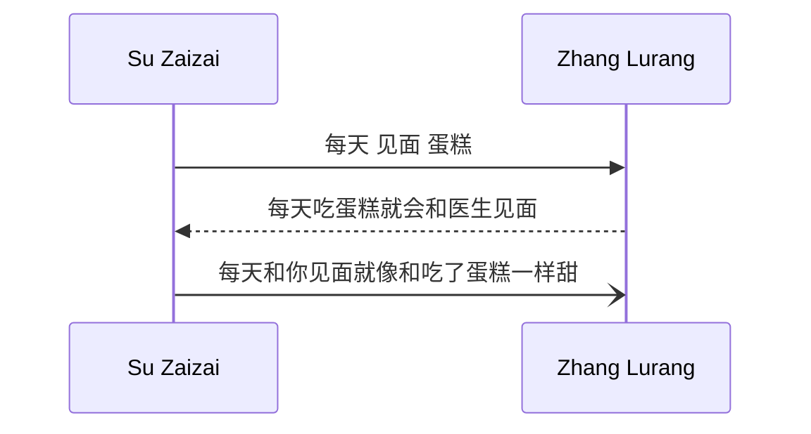


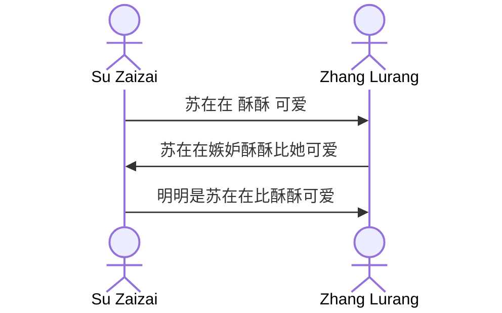


### 角色

- `participant name`：矩形文本
- `actor name`：火柴人
- `participant name as other-name`：起别名（苏在在 as 在在）

创建销毁

- `create participant B`
- `destroy B`

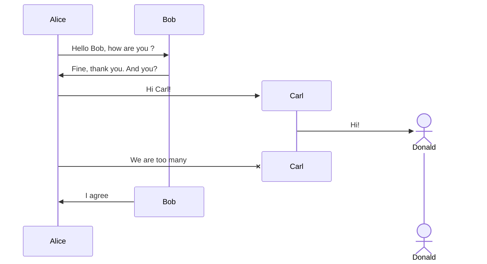


激活（当样式用）

- 可以激活和停用角色。(de)activation 可以是专用声明：
- 消息箭头后附加 `+`/`-` 后缀

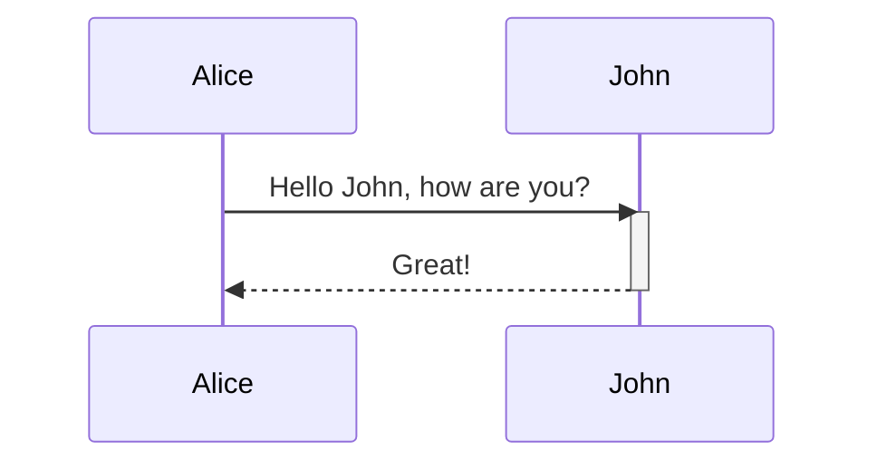

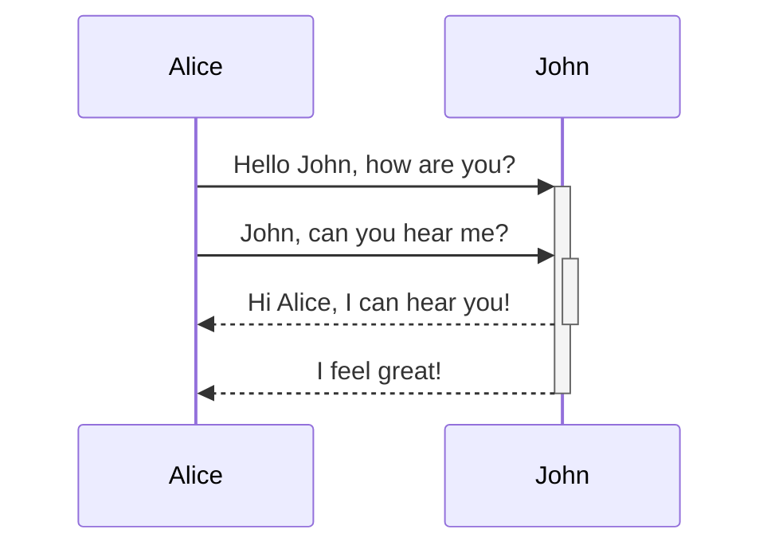


### 发消息

- `[Actor][Arrow][Actor]:Message text`

- `A --> B:message`

| 类型   | 描述                           |
| :----- | :----------------------------- |
| `->`   | 没有箭头的实线                 |
| `-->`  | 没有箭头的虚线                 |
| `->>`  | 带箭头的实线                   |
| `-->>` | 带箭头的虚线                   |
| `-x`   | 末端有十字的实线               |
| `--x`  | 末端带有十字的虚线。           |
| `-)`   | 末尾带有空心箭头的实线（异步） |
| `--)`  | 末尾带有空心箭头的虚线（异步） |

循环

```
loop Loop text
... statements ...
end
```

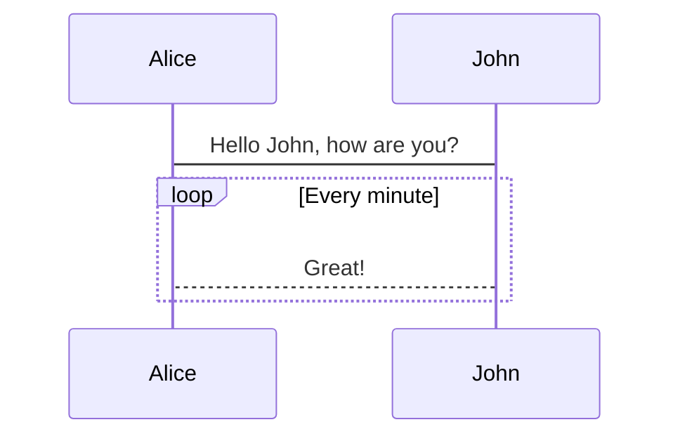


### 装饰

#### 文字注意

- `Note John: Text in note`

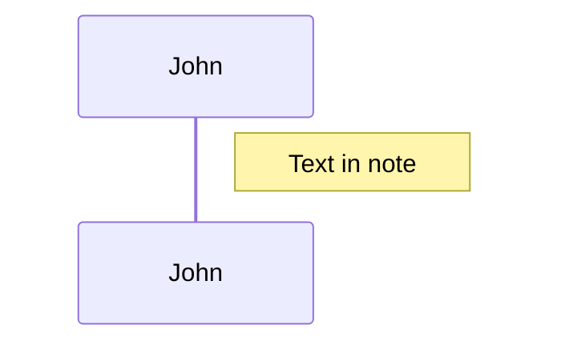


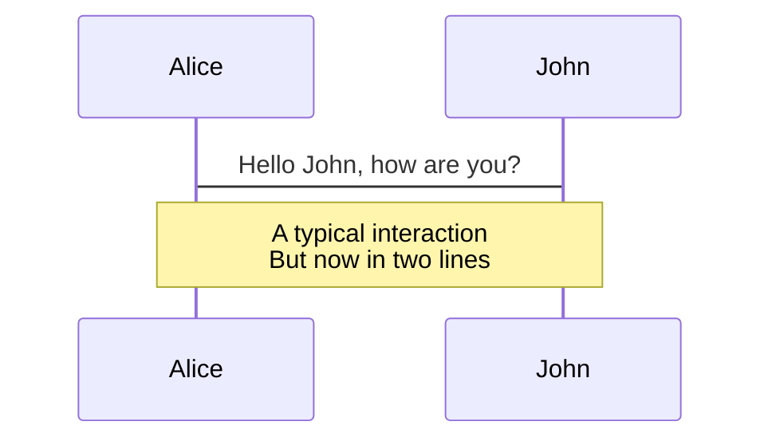


#### 分组、框

```
box Aqua Group Description
... actors ...
end
```

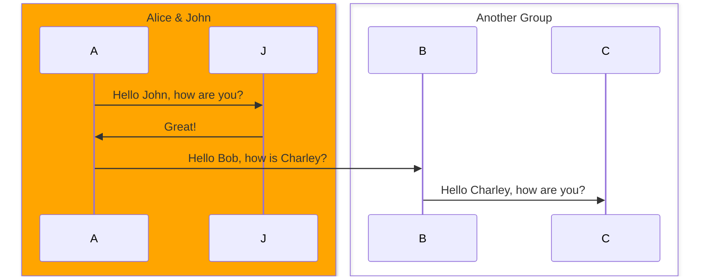


## Git图

- 定义 Git 图：`gitGraph LR`
- `commit` ：代表当前分支上的新提交。
    - `id: "Alpha"`
    - 递交类型：`type: HIGHLIGHT`
        - `NORMAL` ：默认提交类型。图中用实心圆表示
        - `REVERSE` ：强调提交是反向提交。在图中用交叉实心圆表示。
        - `HIGHLIGHT`：高亮图中的特定提交。在图中用实心矩形表示。
    - 标签：`commit tag: "your_custom_tag"`
- `branch "name"` ：创建并切换到新分支，将其设置为当前分支。
- `checkout name`  ：签出现有分支并将其设置为当前分支。
- `merge`：将现有分支合并到当前分支。
    - `id`
    - `tag`
    - `type`


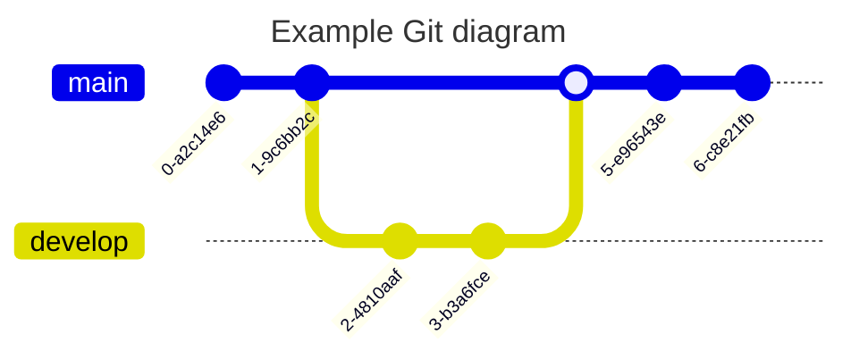

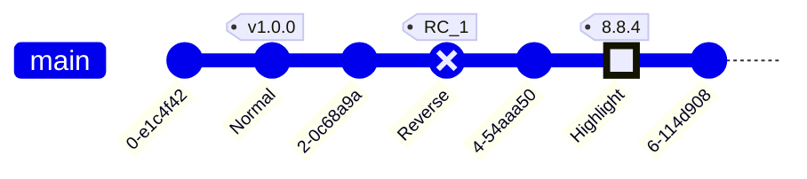


## 用户旅程图

- 定义用户旅程图：`journey`
- `title My working day`
- `section Go to work`

- 任务语法为 `Task name: <score>: <comma separated list of actors>`

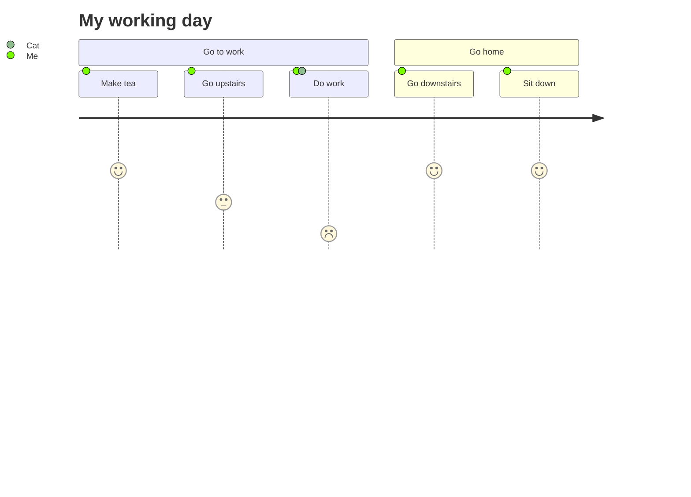

## 思维导图

- 定义思维导图：`mindmap`
- 导图语法格式 == 幕布
- 样式 == 不重要

```mermaid
mindmap
    Root
        A
            B
            C
```


## 时间线

- 定义时间线：`timeline`
- 分组：`section`
- 样式 == 不重要
- 注意：换行用 `<br>`

```
{time period} : {event}
              : {event}
              : {event}
```


```mermaid
timeline
    title History of Social Media Platform
    2002 : LinkedIn
    2004 : Facebook
         : Google
    2005 : Youtube
    2006 : Twitter

```

```mermaid
timeline
    title Timeline of Industrial Revolution
    section 17th-20th century
        Industry 1.0 : Machinery, Water power, Steam <br>power
        Industry 2.0 : Electricity, Internal combustion engine, Mass production
        Industry 3.0 : Electronics, Computers, Automation
    section 21st century
        Industry 4.0 : Internet, Robotics, Internet of Things
        Industry 5.0 : Artificial intelligence, Big data, 3D printing
```


## 类图


```mermaid
---
title: Animal example
---
classDiagram
    note "From Duck till Zebra"
    Animal <|-- Duck
    note for Duck "can fly\ncan swim\ncan dive\ncan help in debugging"
    Animal <|-- Fish
    Animal <|-- Zebra
    Animal : +int age
    Animal : +String gender
    Animal: +isMammal()
    Animal: +mate()
    class Duck{
        +String beakColor
        +swim()
        +quack()
    }
    class Fish{
        -int sizeInFeet
        -canEat()
    }
    class Zebra{
        +bool is_wild
        +run()
    }

```


## ER图


```mermaid
---
title: Order example
---
erDiagram
    CUSTOMER ||--o{ ORDER : places
    ORDER ||--|{ LINE-ITEM : contains
    CUSTOMER }|..|{ DELIVERY-ADDRESS : uses

```


```mermaid
erDiagram
    CUSTOMER ||--o{ ORDER : places
    CUSTOMER {
        string name
        string custNumber
        string sector
    }
    ORDER ||--|{ LINE-ITEM : contains
    ORDER {
        int orderNumber
        string deliveryAddress
    }
    LINE-ITEM {
        string productCode
        int quantity
        float pricePerUnit
    }

```


## 桑基图


```mermaid
sankey-beta

%% source,target,value
Electricity grid,Over generation / exports,104.453
Electricity grid,Heating and cooling - homes,113.726
Electricity grid,H2 conversion,27.14

```


## 饼图

- 定义饼图：`pie`

```mermaid
pie 
	title Pets adopted by volunteers
    "Dogs" : 386
    "Cats" : 85
    "Rats" : 15

```

## XY 图表


```mermaid
xychart-beta
    title "Sales Revenue"
    x-axis [jan, feb, mar, apr, may, jun, jul, aug, sep, oct, nov, dec]
    y-axis "Revenue (in $)" 4000 --> 11000
    bar [5000, 6000, 7500, 8200, 9500, 10500, 11000, 10200, 9200, 8500, 7000, 6000]
    line [5000, 6000, 7500, 8200, 9500, 10500, 11000, 10200, 9200, 8500, 7000, 6000]

```


