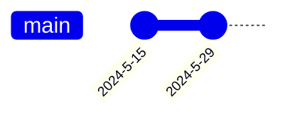

# Raycast 完全使用指南

#### 前置依赖

> - 使用一款笔记软件经历

##### 环境信息

> - MacOS 14
> - Raycast 1.75

###### 目录

> - 为什么需要启动器类聚合软件
> - 简介 Raycast
> - Clipboard History
> - Snippets
> - Quicklinks
> - Window Management
> - 翻译
> - AI
> - 系统快捷交互
>     - Search Menu Items
>     - 卸载 APP
> - 第三方 APP 联动
>     - GitHub
>     - Notion
> - 小功能
>     - 自动切换输入法
>     - 悬浮标签
>     - 打字测速
> - 启动器共通
>     - 搜索
>     - 计算
>     - 打开、关闭、切换 APP

## 为什么需要启动器类聚合软件

我其实一直不是「启动器」类应用的重度用户，普通使用如打开应用、查文件、查词、计算器等操作，用用 macOS 内建的 Spotlight 就足够了。至于剪贴板管理、窗口管理等需求，市面上也有那么多优秀应用供选择。

只不过后来我有了新需求：写文章时需要频繁切换好几个应用，`⌘` `tab` 显得不是那么方便了，就想找一款能「定制打开应用快捷键」的工具（比如 `⌥` `B` 打开 Brave 浏览器，`⌥` `O` 打开 Obsidian 等）。

可是，与其单独再下载一款能满足需求的工具（如 HotKey App），好像还不如直接使用聚合了各种生产力功能的启动器，顺便把 Spotlight 也替换了呢。本着**「能少装一个应用是一个」**的原则，我开始寻找适合自己的启动器类应用。

### 只用一个应用有什么好处呢？

> 管理和迁移方便多了。

Raycast 支持导入导出数据，换设备时可以很方便地迁移所有偏好设置及保存在其中的快捷键、自定义片段等内容。这样一来，比起使用多个应用，把所有数据都汇聚在一个应用里，更便于管理和迁移。将来我换电脑，想从头开始（而不是使用 Migration Assistant 迁移）时，就不用再装好几个应用了。只要一个 Raycast，再导入配置数据就可以了。

### 那为什么不喜欢什么功能都塞进去的 APP

比如 QQ、WeChat等，原本只是通讯聊天软件，慢慢的加入各种花里花哨的功能，甚至可以文字 OCR、记笔记、刷短视频、看文章等等。

这就牵扯到，功能的个体**实用**性了，对于我而言，只需要有通讯聊天的功能，而其它的完全就是臃肿的垃圾功能，压根用不上，反而还会在存储空间上占用位置、UI 界面上繁杂花眼，且用户完全不能自己关闭它。

也就是说，我们需要有的功能集成，不需要的没有。

Raycast 的优势就是自由度极高，可以充分自定义自己的 Raycast 功能。

## Raycast 简介

### 为什么是 Raycast

上文也说，我不算是一个「重度用户」，不需要它有强大的 workflow 等功能，所以**长得好看、符合使用习惯**是最重要的。

Raycast 的界面简洁明了，可以说会用 Spotlight 就会用它。我初次使用时已经是比较新的版本了，v1.26.0 开始的新 onboarding 指南（也就是「新手教学关」），以一种新颖又不失乐趣的方式，带领新用户探索一些 Raycast 的特性，还会有任务与进度追踪，一下子就被吸引住了。再加上开发团队有趣又更新勤快，changelog 写得认真，总之带给我很大好感。

相关网页：

- 官网：https://www.raycast.com/
- 文档：https://manual.raycast.com/
- 开发文档：https://developers.raycast.com/

### 为开发人员定制的生产力工具

Raycast 是直到 10 月 29 日才放出这第一个公测版本，对外宣布种子轮已筹集 270 万美元。根据开发者介绍，Raycast 正是受命令行的启发，作为软件工程师，他们注意到自己真正写代码的时间越来越少，反而需要更多的时间来管理软件开发，例如跟踪 bug 反馈、管理 sprint、发布新版本等等，这些都需要借助网页端或者其它的不同工具来完成。

于是，Raycast 正是为了解决他们的困扰而创建，尽可能将常用的管理开发、内部会议、任务规划等内容集成在一起，腾出更多地时间放在编写代码上。简单过一下 Raycast 目前所能实现的核心功能：

- 在 macOS 上启动程序或者搜索文件，相当于聚焦（Spotlight）；
- 在 Asana、GitHub、Jira 或Linear 中创建、搜索和关闭 issues；
- 批准、合并和关闭 GitHub 的拉取请求；
- 调用 Zoom 管理日常会议；
- 支持快捷设置日程、待办事项以及其它诸多系统设置；
- 支持脚本扩展；
- ……

## 剪贴板历史——替代 pastenow

我对剪贴板管理的需求非常简单：

- 在 Mac 记录最近的剪贴板历史就可以，不需要 iCloud 同步，不需要 Universal Clipboard
- 不需要分组，也不需要无限量历史记录（根据帮助手册中的说明，Raycast 可以保存 256 个历史记录，对我来说足够了）
- 能够预览剪贴板条目内容，并支持文字、图片、文件等，方便统一复制，统一粘贴

### 剪贴板历史界面与操作

## Snippets——替代或扩展 Text Replacement

nippets 即自定义片段，可以保存一些常用的用语，比如邮箱、通讯地址、经常回复其他人的话语、经常使用的代码片段等。

macOS 其实已经有一个内建的 Text Replacement 了，在 `System Preferences > Keyboard > Text` 可以找到它。它可以通过 iCloud 同步，可以在 iOS 的 `Settings > General > Keyboard > Text Replacement` 看到同步的内容。

不过，从上图的界面我们也能发现，它更适合用于管理单行文本或较为简单的内容，而多行文本、代码片段或是单纯字数一多，不论是创建还是管理都有一定困难。

所以我会这样使用：

1. 简单的，需要同步在手机上使用的，放 Text Replacement
2. 复杂的，只会在 Mac 使用的，放 Raycast Snippets

### 创建 Snippets

比如想要创建一个电子邮箱地址的自定义片段，只要搜索 Create Snippet，输入名称、snippet 内容，以及 keyword（可选），就可以了。

keyword 会用在 auto expansion 自动替换上面，比如设置 keyword 为 `@@`，那么每当输入 `@@`，就会自动替换成 `hi@abc.com`。如果没有设置 keyword，就不会自动替换，需要手动搜索这个自定义片段，再复制或粘贴。

> Tip: 上文也提到，我们可以从剪贴板历史条目直接创建一个自定义片段。

要达到同样的目的，Text Replacement 是这样的，也很简单方便，所以我建议短文本可以根据自己的需求来选择使用何种方式创建。长文本的自定义片段一定是 Raycast Snippets 更佳。

### 管理 Snippets

在 Raycast 主搜索框搜索 Search Snippets，或使用别名（如 `ss`），就可以进入自定义片段的管理界面。可以在此执行搜索、筛选、编辑、Pin 住等操作。

**管理界面和上述的剪贴板历史特别像（希望可以再区分一下）。**列表会展示片段名称，如果有添加 keyword 则会一并显示 keyword。

### Snippets 的偏好设置

Snippets 主要有两个指令，创建片段和搜索片段。你可以像我一样为它们设置别名：

可以设置 auto expansion 开关，关闭的话就不会自动替换了，只能在搜索片段的时候手动复制或粘贴。也可以将某些应用排除在自动替换外。

还有一个 `Expand` 方式设置，有三种选项：Immediately、After Delimiter (keeping)以及 After Delimiter (discarding)。它比较 tricky，我在这里可能演示不太出来，大家不妨自行体验感受。

以 `cmd` 变换为 `⌘` 为例：

默认 Immediately 立即变换，将会在输入 `cmd` 后立即变换为 `⌘` **（中文输入法也是如此，不会出现在候选词中，而是直接变换）**

After Delimiter (keeping)，将会在输入 `cmd` 并输入一个分隔符（如 `空格` `/` `.` 等符号）后才进行变换，**同时保留（keeping）这个分隔符。**

After Delimiter (discarding)，将会在输入 `cmd` 并输入一个分隔符（如 `空格` `/` `.` 等符号）后才进行变换，**但是会删去（discarding）这个分隔符。**

如果不想立即变换，比如有时候输入 `cmd` 是真的只想输入 `cmd` 而不想变换成 `⌘`，那么 After Delimiter (discarding) 可能是一个更好的选择：**超过一定时间不输入分隔符，就不会再进行变换了。**

## Quicklinks

###浏览器书签查询

书签查询功能也是通过额外的功能拓展方式添加，需要手动在 Raycast 设置中开启，如果需要读取 Safari 浏览器书签列表，还需要在「系统偏好设置 - 安全性与隐私 - 完全磁盘访问权限」中授予 Raycast 对应的权限。

## 窗口管理——替代 Magnet

相信大家使用 Mac，窗口管理器一定是必不可少的应用类别之一了。不管是商店付费的 [Magnet](https://sspai.com/link?target=https%3A%2F%2Fmagnet.crowdcafe.com%2F) 还是开源免费的 [Rectangle](https://sspai.com/link?target=https%3A%2F%2Frectangleapp.com%2F) ，都是热门之选。

### 窗口管理操作

## 查词——替代 Dictionary、easydict

## AI（付费）

## 小功能

### 搜索

### 资讯浏览

### 计算器

### 汇率转换

### 时间查询

### 悬浮便签

## 第三方联动

### 支持管理日程、待办事项

## 系统快捷设置，支持脚本命令

### Search Menu Items——替代状态栏菜单

Raycast 有一个 Search Menu Items 的功能，是我最近的心头好。它可以帮助搜索状态栏菜单，也就是应用的这一栏：用在那些**「知道某个选项的名字，但不知道放在菜单哪一层级」**的情况下，特别实用。这是什么意思呢？比如在 Stickies 这个应用里，我想要暂时取消「自动改正拼写检查」，我知道菜单栏条目大概是叫做 spell check…之类的，但是不知道具体名称，也不知道具体在哪一级菜单下面，找起来就很麻烦。

这时我就可以直接在 Search Menu Items 里搜索 spell，就能快速定位到相关的选项。如果它们有自带的快捷键，也能显示快捷键。

再比如有些常用的 export、浏览器的书签管理和插件管理页等，可能突然忘记了快捷键，直接搜一搜就能找到了。

> Tips: 如果经常用到状态栏菜单搜索，用别名可能不是最方便，我建议使用快捷键（如右侧的 `⌥` + `/` ，按起来也很快速）。

### 卸载应用——替代 AppCleaner

AppCleaner 想必也是大家的必备品。它可以在删除应用的同时在系统 `~/Library` 等路径检测关联文件，以便同时删除、彻底删除一个应用。

而在 v1.31.0 版本更新中，Raycast 也增加了这一卸载应用的选项，并且也支持检索关联文件。只要搜索某一应用，按 `⌘` `K` 打开更多操作，搜索 uninstall application 就可以了。

## 启动器共通

