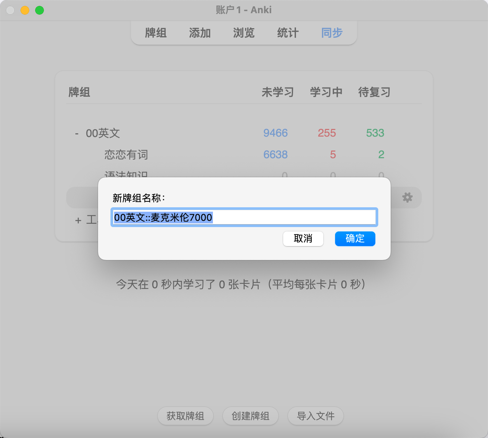
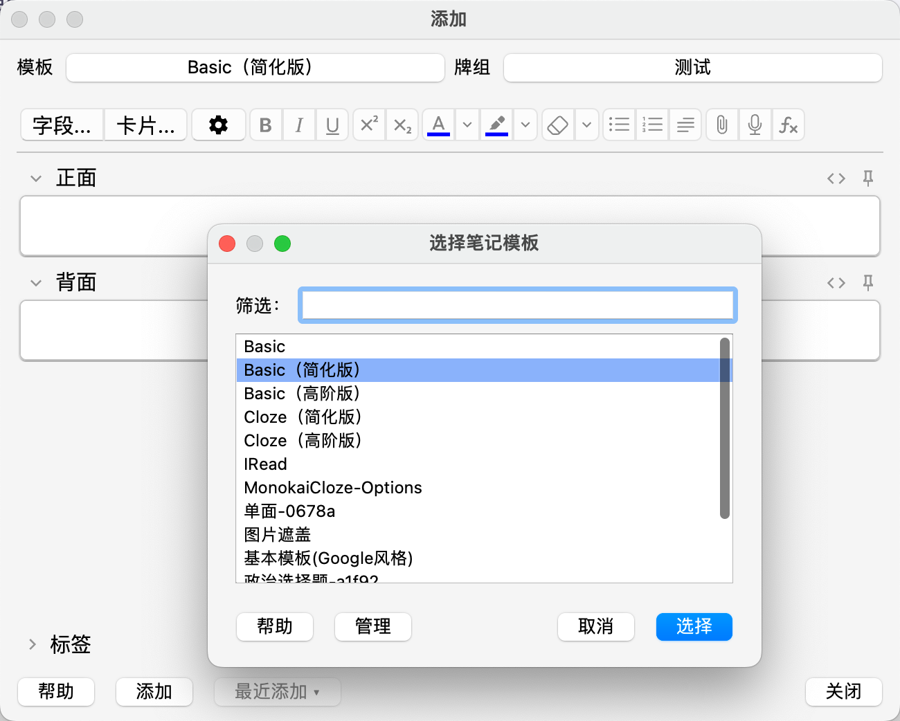

# Anki

- Anki 是什么
- Anki 能做什么
- 如何使用 Anki
- 我的 Anki 使用心得

## Anki 是什么

Anki 是一款免费开源的辅助**记忆**工具，通过记忆遗忘曲线制定卡片复习计划，卡片是 Anki 里每一个知识点的代称。

注：除了 iOS 端是个人开发者开发的软件外，其它平台 Anki 完全免费，可以在官方下载

Anki 官网：https://apps.ankiweb.net/

## Anki 能做什么

Anki 的核心作用便是帮助记忆，让知识牢牢记在脑海里。

## 如何使用 Anki

要使用 Anki，必须具备 Anki 软件本身和卡片。以上博文我们解决了软件本身的安装，且简单认识了卡片是 Anki 里知识点的代称。那么我们该如何将日常笔记里的知识点放入 Anki 里形成卡片呢？

### 卡片

制作，自定义卡片模板，获取他人分享卡片

问题和答案的配对称之为卡片。

例如官方文档给出的示例：

```
问题：氧气的化学符号是什么？
```

你在思考之后，决定答案是O，单击显示按钮，Anki会显示：

```
问题：氧气的化学符号是什么？
答案：O
```

### 制作卡片

制作卡片分两步，创建牌组和编辑卡片（牌组是很多卡片组成牌组）。



选择对应的卡片模板，随后编辑卡片内容。



### 获取他人牌组

若是懒得自己制作卡片，也通过网络获取他人分享的牌组。

官方获取卡片牌组：https://ankiweb.net/shared/decks/

### 学习卡片

- 设置记忆内容的选项
- 点击需要记忆的牌组
- 开始记忆

Anki 的学习卡片，通过卡片正面的问题回忆答案，随后点击“显示答案”查看卡片的背面（答案），用户根据“忘记、困难、良好、简单”表明对卡片的记忆程度。Anki 会根据用户选择的选项调整卡片的复习频率，实现重复间隔学习。

.png)

## 我的 Anki 使用心得

一切皆是文科，一切始于记忆，必须先记住，才能有后续。

博主的个人观点，对于基础内容的学习，没有什么文理工的区分，都属于文科，文科一个很大的特点就是记忆、背诵。仔细回忆一下中学时，学习数理化是不是都要先记忆核心的知识点和公式方法，才能够去理解新的知识点和题目，才能够去通过理解记忆，或者通过逻辑推导记忆，往往这时感受到在学习理科，但殊不知这么做的前提是已经记忆了基本的知识点和公式，才能推出后续的结果。记忆才是那个基础，什么都没有的情况下是没办法得出更多结论的。故而一切皆是文科，一切始于记忆，是强调记忆的重要性，不要抵制背诵，因为它是一切的开始。必须先记住，才能有后续，脑子里什么料都没有，任如何掀也掀不起什么风浪，因为根本不知道风浪为何物，只有见过风浪后才能创造新风浪。

Anki 便是记忆非常强大的辅助工具，它开源免费，多端同步，博主经常在 MacBook 编辑卡片，随后在 iPhone 里不断记忆卡片。


