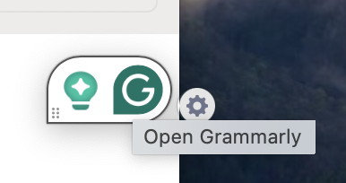
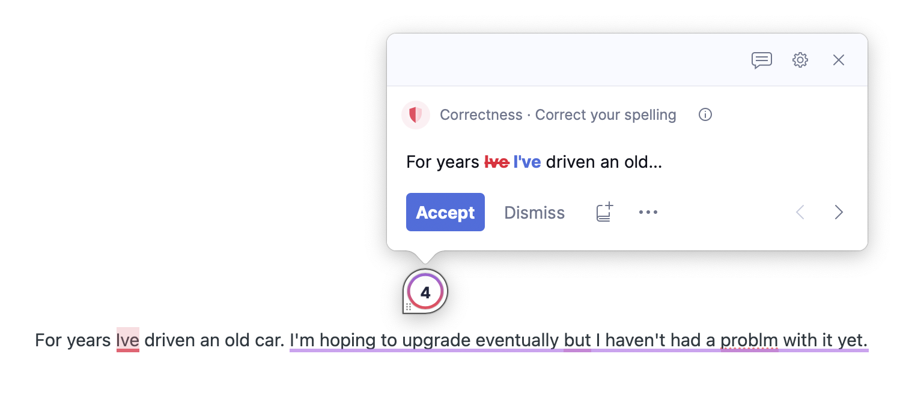

# Grammarly

- Grammarly 是什么
- 如何使用 Grammarly

-----

## Grammarly 是什么

Grammarly 是一款英文的语法检查和改进工具，可以实时反馈英文写作建议。

可以直接在浏览器中编写和编辑文档，而无需安装任何其他应用程序。此外可以安装 Grammarly 的 APP，这样可以在电脑的任何写作软件里使用 Grammarly 的功能。

安装Grammarly：https://www.grammarly.com/native/mac

## 如何使用 Grammarly

当 Grammarly 检查您的文本时，您会看到一些关键建议的下划线。要访问 Grammarly 提供的所有建议，单击屏幕上的 Grammarly 图标。

建议分为四类

- 正确性（用红色下划线表示）- correctness (indicated with a red underline),
- 清晰度（蓝色）- clarity (blue),
- 参与度（紫色）-  engagement (purple)
- 交付（绿色）- delivery (green)

## 调整的目标

## 生成式人工智能辅助

注意免费版的月100 次限制，2024 年 4 月的数据。

- **撰写**— Grammarly 将立即根据该提示撰写文章。

- **重写**——立即生成根据语气、清晰度或长度定制的新版本。

- **回复**— Grammarly 将使用您收到的电子邮件中的上下文来提供用于生成回复的即时选项，并将其他上下文（例如发件人姓名和意图）集成到生成的回复中。

