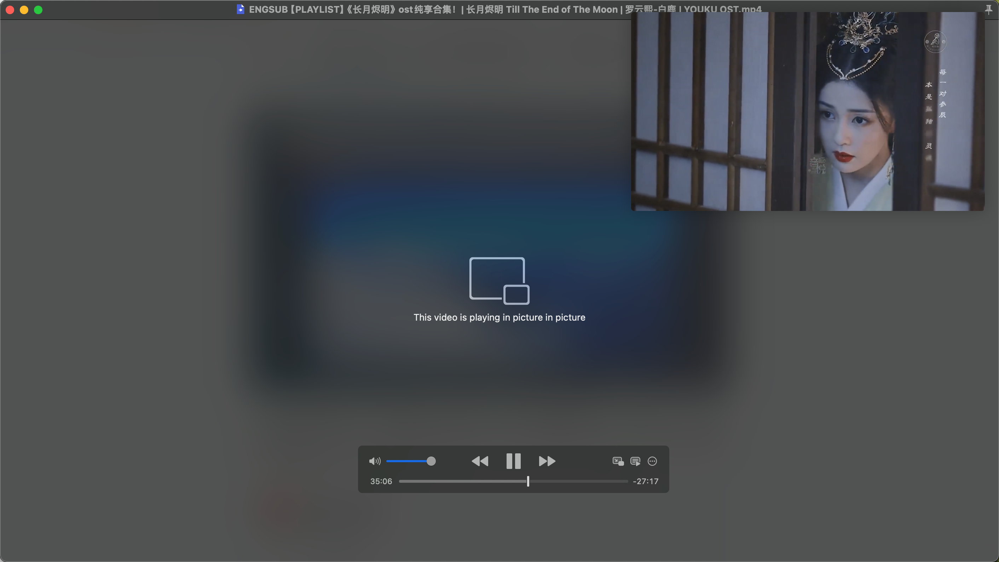
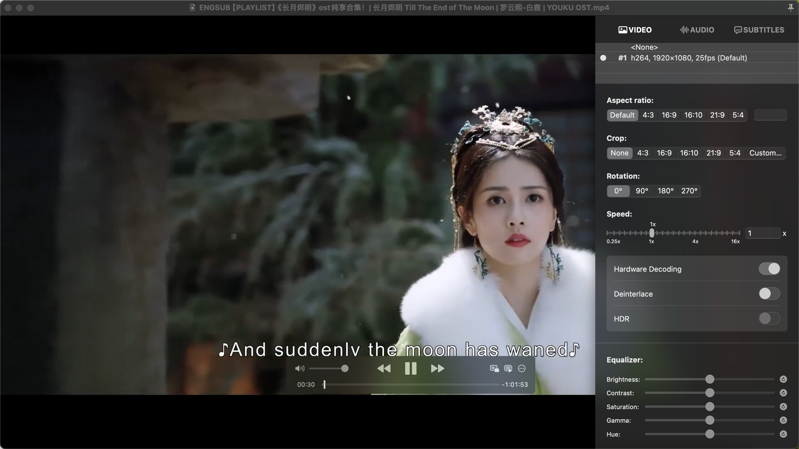
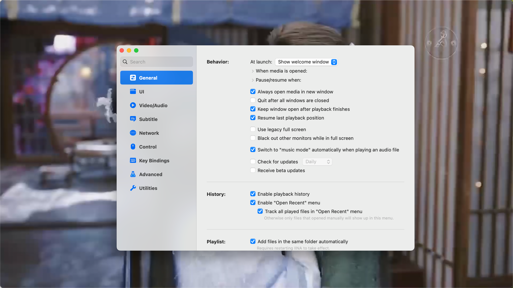
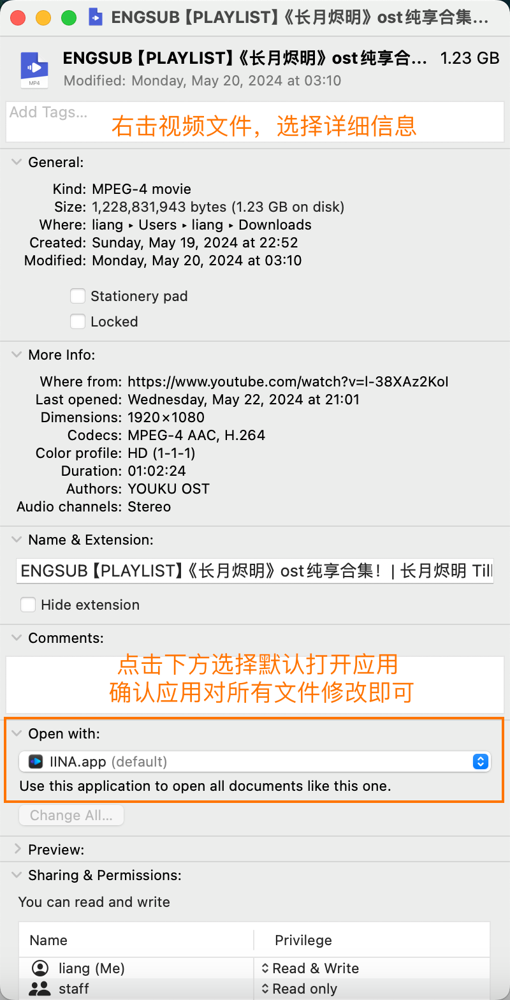

# IINA

- 为什么是 IINA
- IINA 是什么
- IINA 能做什么
- 如何使用 IINA
- 我的 IINA 使用心得

----

## 为什么是 IINA

对我来说，一款合格的本地视频播放器，一定要兼顾到以下这三个特点：

1. 可以播放尽可能多的视频格式；
2. 支持外挂字幕和字幕的简单调节；
3. 简约的外观且没有广告。

当然，如果这款播放器是免费的那就更好了。接下来要介绍的 *IINA*，不仅完美的满足了我的需求，而且开源免费。

## IINA 是什么

IINA 是一款 Mac 下原生开源的强大播放器，（几乎）可以播放所有视频格式，甚至于还可以将网页在线视频转到 IINA 播放，同时也可以配合其它工具实现播放云盘里的视频文件。

- 官网：https://iina.io/
- GitHub：https://github.com/iina/iina
- `brew install --cask iina`

## IINA 能做什么

- 播放视频、音频、图片
- 播放设置
- 外挂字幕
- 播放在线视频
- 画中画
- 面向高级用户的 MPV 配置文件和脚本系统

## 如何使用 IINA

和使用系统自带的播放器一样，点击视频文件（IINA 为默认播放器），或者右击选择打开方式，选择 IINA 打开。

打开 *IINA*，你可能会有种似曾相识的感觉。没错，单看外观，无边框的播放界面加上简洁的播放控制框，*IINA* 与系统自带的 *QuickTime* 确实比较相像：外观简约、没有广告。

首先，基于 *mpv* 播放器开发的 *IINA*，几乎可以播放所有格式的媒体文件，这个格式可不止视频，音频和图片都没有问题。

### 播放设置

画中画、倍速、裁切、旋转、调色、外挂字幕、HDR……你想要的它都有。

*IINA* 支持 macOS 原生的画中画功能，点击控制栏的画中画图标，就可以让本地视频悬浮在屏幕上，上课笔记或者工作摸鱼，都是一个不错的选择。

作为一款使用 Swift 编写、仅支持 macOS 的播放器，*IINA* 对系统的优化支持也不少。前面提到的画中画正是利用了 macOS 的系统特性。

针对苹果电脑以及各种官方外设，*IINA* 也有不少优化的地方。比如，你可以通过在触控板或妙控鼠标上滑动，来快进快退（左右）或者调节音量（上下）。

倍速播放已经成为了视频网站的必备，*IINA* 为本地视频也增加了这一功能。在它的视频设置界面中，提供了最高 16 倍的加速播放和最低 1/4 倍的慢速播放。追剧追综艺想要快速看完全程，2 倍速 3 倍速随你选，学习舞蹈武术想要看清讲师的操作，1/2 倍速 1/4 倍速随你挑。

除了倍速播放，从常见的裁切、长宽比调整，到视频的亮度色调对比度、音频的轨道延迟均衡器，如果你不喜欢导演对电影的调色，你甚至可以在 *IINA* 为视频调出一个专属你的色调。

视频播放设置只是 *IINA* 功能的一部分，打开它的偏好设置，你会看到一个更加丰富的自定义界面。从初始窗口的大小到工具栏上的调整、左右箭头的功能，甚至连播放控制器的位置都可以根据你的喜好随意调整。（博主是从来都没动过偏好设置，全用默认的设置）

## 播放在线视频

据官网介绍，在 *youtube-dl* 和浏览器插件的支持下，*IINA* 还可以播放在线流媒体。

不知为何，我尝试 B 站和 YouTube 都没有成功（据说是要需要先配置好 youtube-dl 路径，博主对此不感兴趣，故而不折腾），反而尝试 alist 挂载云盘成功了。

### 补充：IINA 设置成 Mac 默认播放器

右击视频文件—>详细信息—>打开方式—>选择 IINA

## 我的 IINA 使用心得

如果你不愿折腾，简约的外观加上针对 macOS 优化的功能，*IINA* 完全可以成为你 Mac 的默认播放器，让你在看视频时不会因为格式不支持、界面太落伍而产生体验的割裂感；如果你个性十足，那丰富的功能加上开源的特性，*IINA* 也能满足你不同场景、不同类型的视频播放需求。

总而言之，*IINA* 从界面外观到功能设置都有可圈可点之处，想要在 Mac 上播放本地视频，就用 *IINA* 开启一个新世界的大门吧！