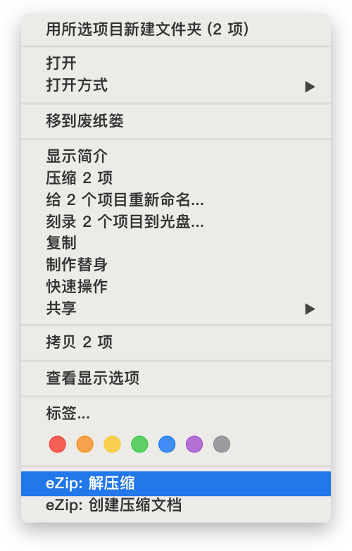
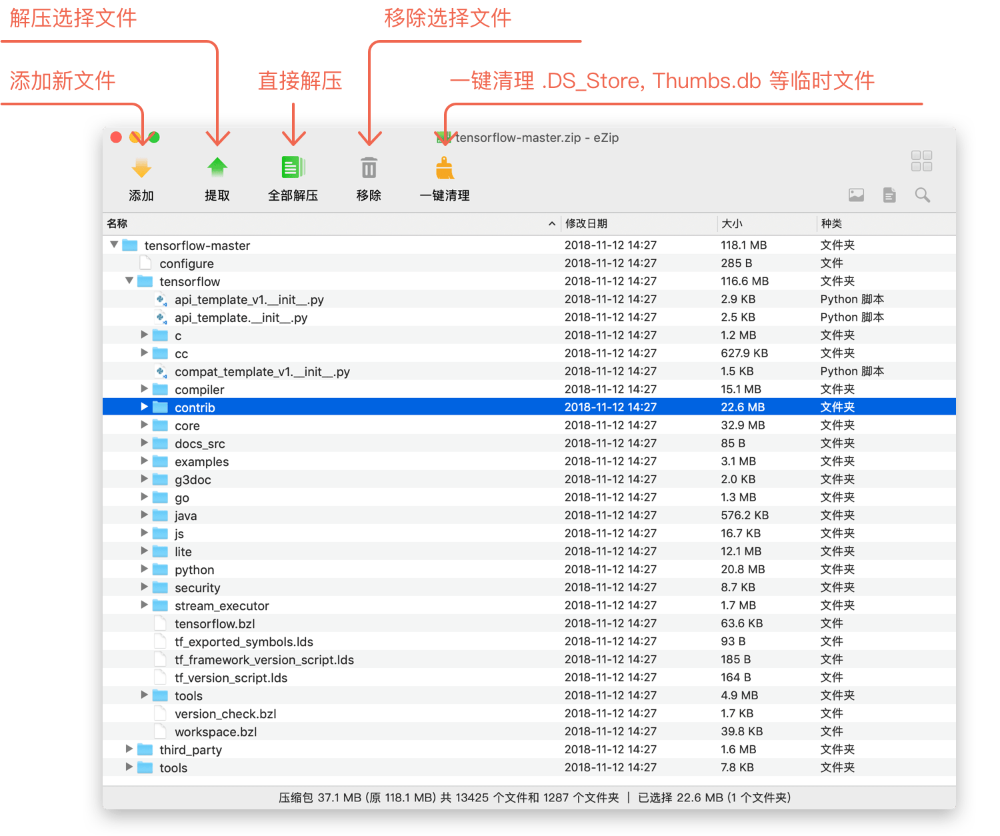
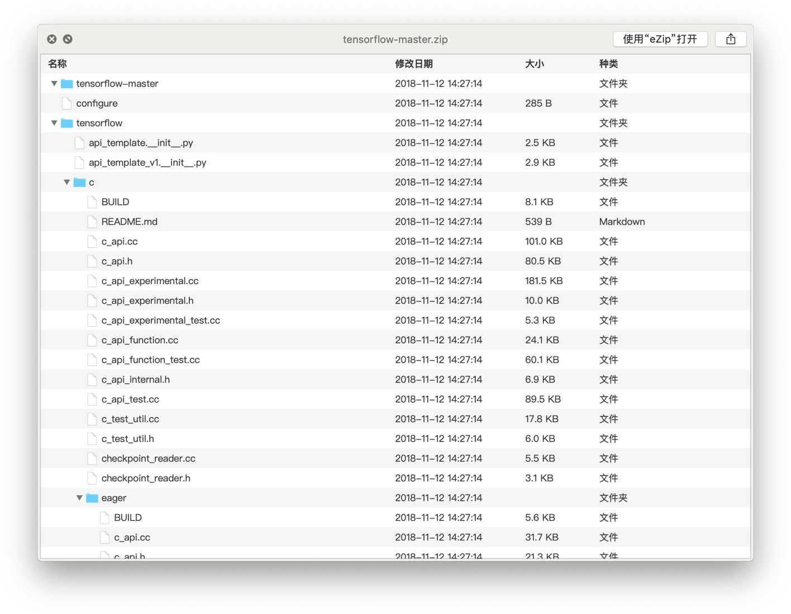
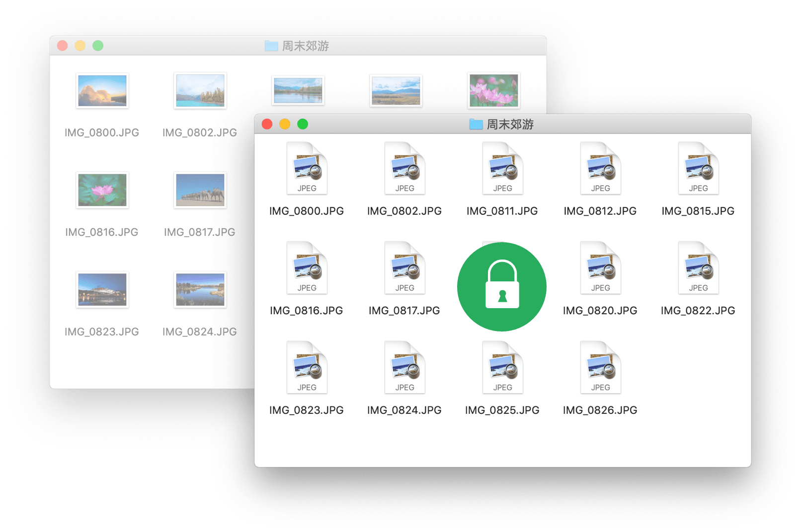

# Maczip

- Maczip 是什么
- Maczip 能做什么
- 如何使用 Maczip
- 我的 Maczip 使用心得

----

## Maczip 是什么

Maczip 是一款 Mac 下简单免费的解压缩软件。完美兼容 macOS & 苹果芯片，支持超过 20 种压缩格式（换句话说，你能见到的它都支持），甚至还支持批量文件加密。

- 官网：https://maczip.cn/

- `brew install --cask maczip`

## Maczip 能做什么

- 查看、编辑压缩包，无需解压！
- Quick Look 预览压缩包！
- Finder 右键，一键压缩、解压文档
- 批量加密、解密文件

## 如何使用 Maczip

Finder 右键，一键压缩、解压文档：

设置成默认解压缩应用后，双击即可打开：

Maczip 还支持空格预览（Quick Look 预览）压缩包！

批量加密、解密文件：

## 我的 Maczip 使用心得

对于 Maczip 这款软件，博主对它的感觉就是几乎没有存在感，每当需要时，便直接解压，直接压缩，很少会用到其它功能。它对我来说，就是一个简单免费无广告的解压缩软件。

