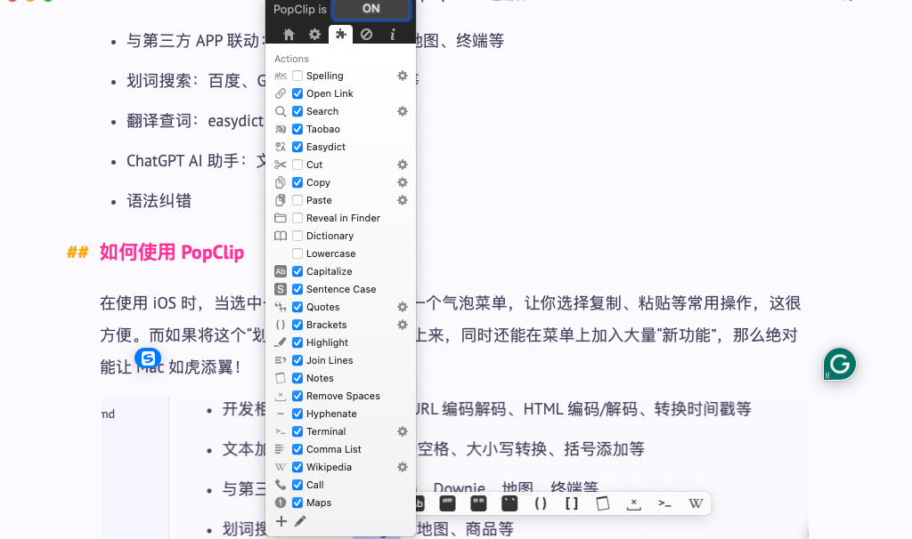

# PopClip

- PopCilp 是什么
- PopClip 能做什么
- 如何使用 PopClip
- 我的 PopClip 使用心得

----

## PopClip 是什么

**PopClip** 是一款超实用的 Mac **全局划词增强辅助**的效率工具！你只需用鼠标选择一段文字，它就能马上弹出“多功能菜单”(软件拥有丰富的插件扩展)，让你进行各种各样的快捷操作。

## PopClip 能做什么

- 开发相关：文本 Base64 、URL 编码解码、HTML 编码/解码、转换时间戳等
- 文本加工：格式转换、除去空格、大小写转换、括号添加等
- 与第三方 APP 联动：Notion、Downie、地图、终端等
- 划词搜索：百度、Google、地图、商品等
- 翻译查词：easydict、词典等
- ChatGPT AI 助手：文本润色
- 语法纠错

## 如何使用 PopClip

在使用 iOS 时，当选中一些文字后，会弹出一个气泡菜单，让你选择复制、粘贴等常用操作，这很方便。而如果将这个“划词操作”搬到 macOS 上来，同时还能在菜单上加入大量“新功能”，那么绝对能让 Mac 如虎添翼！

## 我的 PopClip 使用心得

文本

