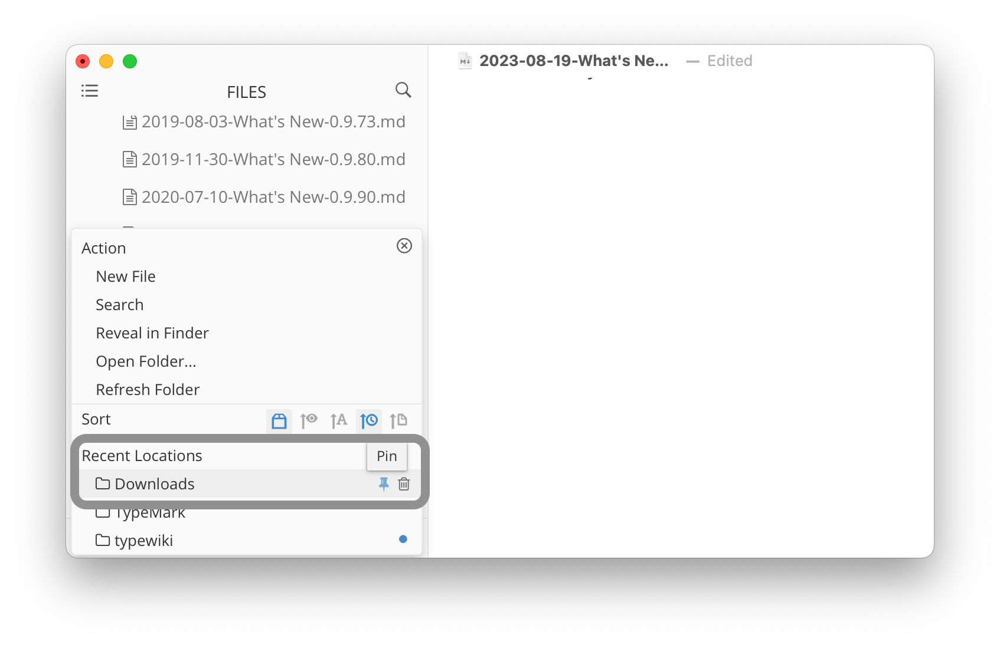
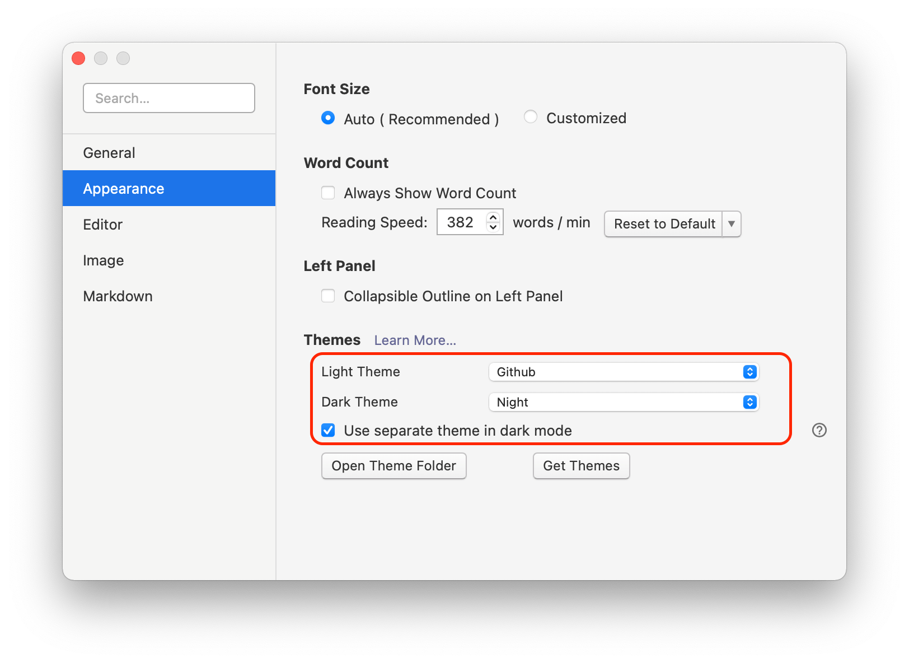
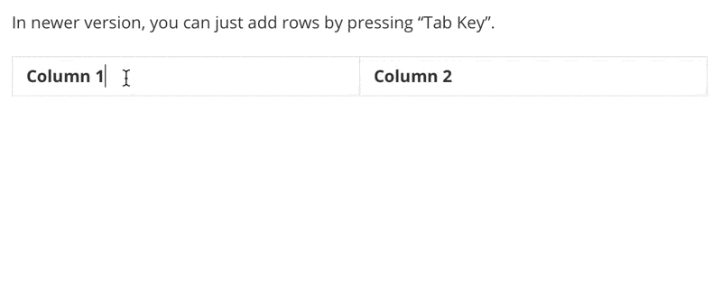
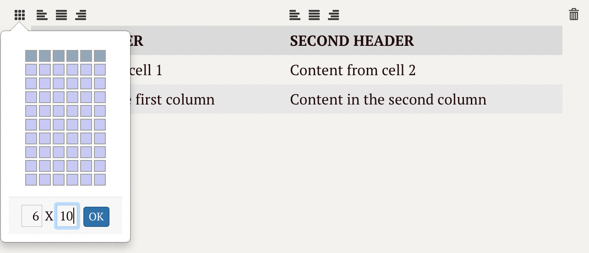
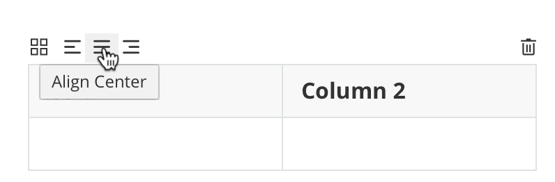
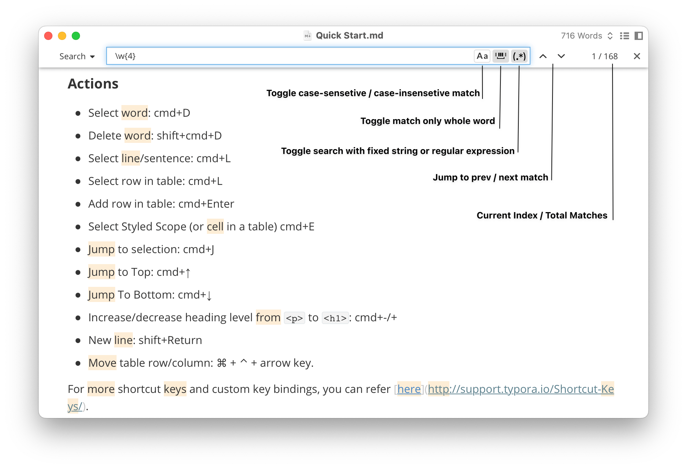
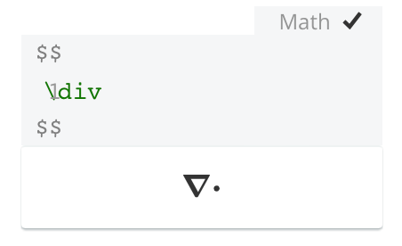
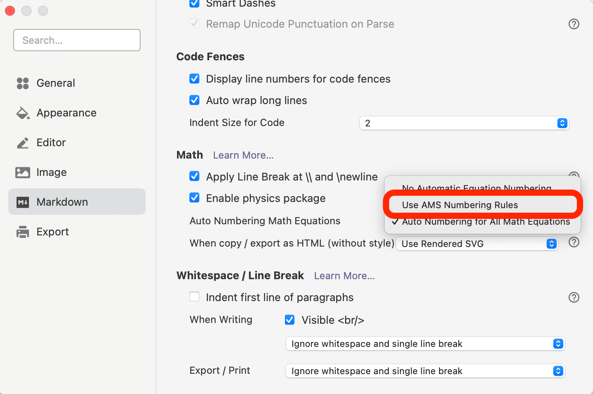
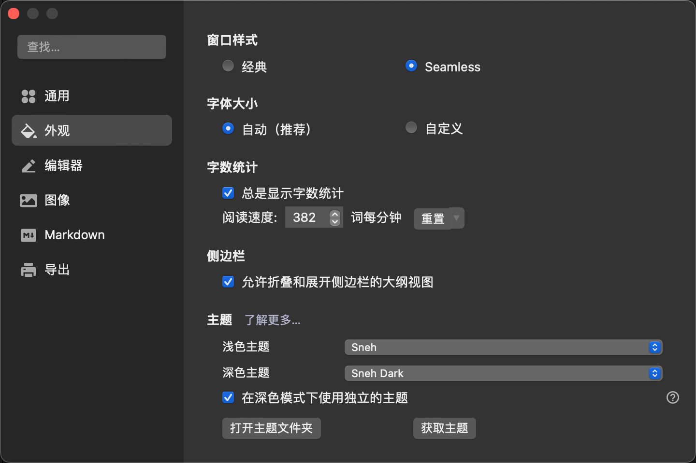
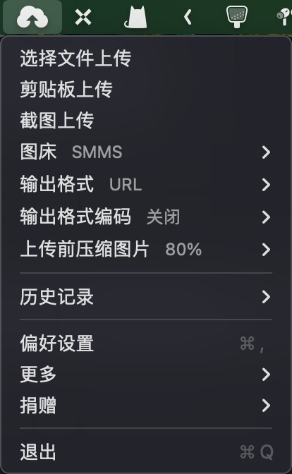

# Typora

##### 相关

> - 官网：https://www.typora.io
> - 文档：https://support.typora.io/
> - `brew install --cask typora`
> - 全平台支持，付费买断 89￥

###### 目录

> - Typora 是什么
> - Typora 能做什么
> - 如何使用 Typora
>     - 软件体验
>         - 文件管理
>         - 导出
>         - 专注模式
>         - 主题
>             - 开发主题
>     - Typora 对 Markdown 的优化体验
>         - MacOS 优化体验
>         - 基本 Markdown 语法
>         - 自动配对
>         - 链接
>         - 图片
>         - 表格
>     - Typora 扩展语法
>         - 目录
>         - 表情
>         - 绘制图表
>         - 数学公式
>         - 物理公式
>         - 化学方程式
> - 我的 Typora 使用心得
>     - Typora 主题
>     - 常用快捷键

---

## Typora 是什么

Typora 是一款轻便简洁的 Markdown 编辑器，支持即时渲染技术，这也是与其他Markdown编辑器最显著的区别。即时渲染使得你写 Markdown 就像是写Word文档一样流畅自如。

## Typora 能做什么

- 编辑和实时渲染 Markdown
- 提供便捷的 Markdown 操作
- 丰富的拓展语法

## 如何使用 Typora

### 软件体验

#### 文件管理

固定文件夹和最近文件夹

当您打开文件侧边栏上的底部菜单时，您现在可以将鼠标悬停在最近的文件夹项目上，然后单击“固定”按钮将其固定。您也可以单击“删除”按钮从最近的文件夹列表中删除某个文件夹，也可以从“文件”→“打开最近使用的”菜单栏中删除某个文件夹。



#### 导出


#### 专注模式

视图-打字机模式/专注模式 开启或关闭：

- 「打字机模式」使得你所编辑的那一行永远处于屏幕正中央。
- 「专注模式」使你正在编辑的那一行保留颜色，而其他行的字体呈灰色。

#### 主题

我们有一个官方网站[Typora 主题库](http://theme.typora.io/)，供设计师/开发人员与他人分享他们的自定义主题。您可以从那里下载主题。



### Typora 对 Markdown 的优化体验

#### MacOS 优化体验

- 在 macOS 上，已经支持原生的“捏合缩放”功能。
- 

#### 基本 Markdown 语法

换行

段落只是一行或多行连续的文本。在 markdown 源代码中，段落由多个空行分隔。在Typora中，您只需按下 `Return` 即可创建新段落。

引用

在typora中，只需输入’>’后跟引用内容即可生成块引用。Typora将为您插入正确的“>”或换行符。通过添加额外级别的“>”允许在块引用内嵌入另一个块引用。

链接

要创建内联链接，请在链接文本的结束方括号后立即使用一组常规括号。在常规括号内，输入URL地址，以及可选的用引号括起来的链接标题。

- `control + k`：直接将剪贴板链接，嵌在选中文字上

- Typora也将自动链接标准URL。例如： www.google.com.

#### 自动配对


#### 图片

- Command + V  将网络图片、剪贴板图片复制到文档中
- 拖动本地图片到文档中

Typora 会自动帮你插入符合 Markdown 语法的图片语句，并给它添加alt。

下载/移动/复制所有图像到文件夹

他们会将所有使用的图像复制或移动到新文件夹，并更新 Markdown 文件中的路径引用。如果您的图像是远程图像，则 Typora 会下载它们并将其保存到目标文件夹。

自动移动图像文件夹

当您在 Typora 窗口中重命名或移动当前文档时，如果您的图像文件夹与您的文件路径/名称绑定，typora 现在将弹出一个对话框，让您移动图像文件夹。例如，如果您在“首选项”面板中设置为 `${filename}.assets` 图像文件夹，并且当前文档名称为 `file 1` 。然后，如果您将当前打开的文件重命名为 `file 2` ，则 typora 将帮助您将图像文件夹从 `file 1.assets` 移动到 `file 2.assets` 并更新当前文档中的引用。

#### 表格

输入 `| First Header | Second Header |` 并按下 `return` 键将创建一个包含两列的表。

我们还提供菜单项、上下文菜单、快捷键、拖放、移动、工具提示，以便在相关的 GUI 下更轻松地使用表格编辑。

可以跳过以下描述，因为表格的 markdown 源代码是由typora自动生成的。

### 在表中添加行

按下`Command/Ctrl+Enter`可在当前表格行下快速插入一个空行，或者使用上下文菜单（右键单击）。

在新版本中，您只需按“Tab 键”即可添加行。



### 删除表中的行

删除行命令（Shift+Alt+Ctrl/Command+L）或删除表格行命令（Shift+Ctrl/Command+Backspace）将删除表格中的当前表格行，或者使用上下文菜单（右键单击）。

### 在表中添加/删除列

右键单击表格单元格，在上下文菜单中，有用于添加/删除表格列的菜单项。

### 调整表格大小

将光标放在表格内，表格工具提示将显示在表格标题上方。单击最左侧的图标，即可调整表格大小。

如果要使表格大于 6 列或 10 行，您可以单击行/列号并输入一个数字。



### 列中的文本对齐

在[GitHub Flavored Markdown](https://guides.github.com/features/mastering-markdown/)中，可以按如下方式指定列对齐：

```
| Default | Left  | Right | Center |
| ------- | :---- | ----: | :----: |
| cell1   | cell2 | cell3 | cell4  |
```

在 Typora 中，您可以通过从表格工具提示中选择相关的对齐图标来简单地更改列下的文本对齐方式，如下所示：



设置对齐后，Typora 将向`style="text-align: left"`当前列添加类似的属性（`<td>`），但最终的对齐仍然可以通过当前主题或自定义 CSS 中的 CSS 规则进行更改。

### 移动行/列

通过 Typora 的所见即所得功能可以轻松重新排序行/列。只需单击行/列的左/上边框，然后使用拖放操作即可移动它：


#### 代码块

默认语言

- 从菜单栏、上下文菜单或快捷键添加代码围栏时应用默认代码语言。
- 通过输入 markdown 语法添加代码围栏时应用默认代码语言 ````` 。您可以按退格键或撤消键删除自动应用的代码语言。
- 适用于这两种情况。

您还可以选择“上次使用”，以便在插入新代码块时自动应用上次使用的代码语言。

#### 搜索/查找和替换

- 现在，您可以查找内容并将其替换为正则表达式。
- 文件搜索中也支持正则表达式。（ `View` → `Search` 面板）。



### Typora 扩展语法

#### 目录

- `[TOC]` 生成目录
- 输入 `[toc]` 然后按 `Return` 键将创建一个“目录”部分，自动从文档内容中提取所有标题，其内容会自动更新。

#### emoji 表情

输入表情符号的语法是 `:smile:`

用户可以通过 `ESC` 按键触发表情符号的自动完成建议，或者在偏好设置面板里启用后自动触发表情符号。此外，还支持直接从 `Edit` -> `Emoji & Symbols` 菜单栏输入UTF8表情符号字符。

- `:emoji:` 的形式来打出 emoji，软件会自动给出图形的提示

#### 数学公式

添加了在数学中自动应用 `displaylines` 环境的选项，以支持使用 \ 进行换行。

将 MathJax 升级到 3.2.2，其中包含的改进包括：

- Add `\textup` and `\textnormal` to macros allowed by `textmacros`.
- Update `\operatorname` to work more like in LaTeX.
- 让物理包匹配嵌套括号，修复间距问题。
- 其他，请参阅 https://github.com/mathjax/MathJax-src/releases/tag/3.2.1

我们添加了一个启用或禁用 `physics` 包的选项，该选项将替换旧的“启用后，\div、\Re 等命令将由物理包重新定义”选项。示例如下：



修复 `Copy as MathML` 了数学块无法正常工作的问题。一个提示是，您可以在 Typora 的数学块中进行选择 `Copy as MathML` ，然后在 Word `Keep Text Only` 中选择 `Paste` →以粘贴数学内容。

添加新的数学自动编号规则 — AMS 编号规则（其中只有某些环境生成编号方程，就像在 LaTeX 中一样）。




#### 绘制图表

Support inline mermaid config (https://mermaid-js.github.io/mermaid/#/./directives)

支持内联美人鱼配置 （ https://mermaid-js.github.io/mermaid/#/./directives）


## 我的 Typora 使用心得

### Typora 主题

在设置的外观里可以设置主题。博主非常喜欢 Essay、Latex、Orangeheart、Sneh，这四个主题，兼有严格的格式和好看的外表。



更多主题可以去 Typora 的官网获取。

### Typora 图床服务

Typora固然好用，MarkDown也固然好用，但图片该怎么处理？总不能自己一张张的上传，然后在复制网络连接吧，也不是不可以🤔。

我使用的图床上传服务软件是 `uPic` ，它开箱即用，且有 iOS 端的 APP。

更多的关于图床的内容，可以参考我的其它文章。

