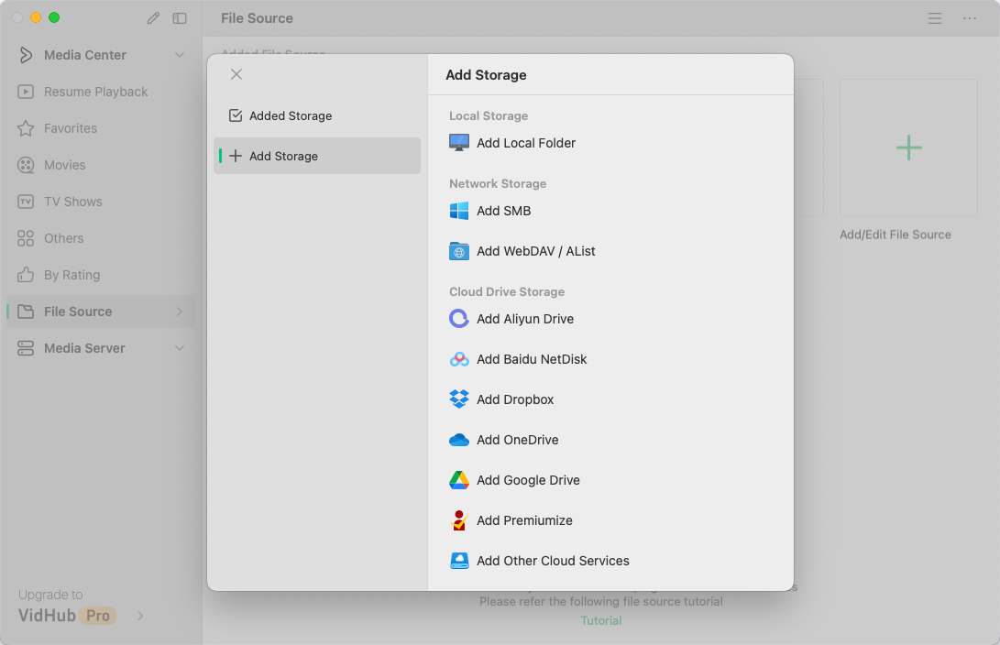
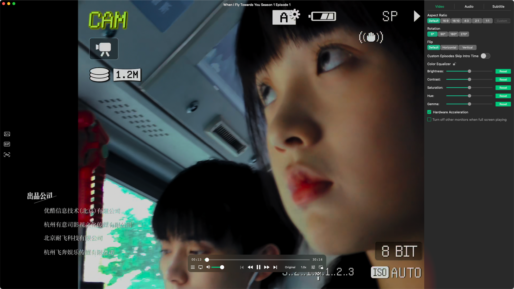

# VidHub

- VidHub 是什么
- VidHub 能做什么
- 如何使用 VidHub
- 我的 VidHub 使用心得

----

## VidHub 是什么

VidHub 是一款可以根据文件名自动获取片源海报并自动整理出类似影视平台界面的展示，同时 VidHub 作为一款国人开发的软件，支持云盘挂载，只能说到这里了，不能再多说了。

国产媒体播放器软件 **VidHub**，支持本地、局域网共享、云盘挂载。

- 官网：https://vidhub.okaapps.com/

## VidHub 能做什么

- Apple 全平台同步 iPhone、iPad、Mac、Apple TV
- 自动匹配源文件的影视信息、海报图片
- 支持批量格式化修改文件名

## 如何使用 VidHub

使用 VidHub 的第一步就是添加文件源，博主使用的事阿里云盘和百度网盘服务。添加方式非常简单，按照官网给出的[教程](https://vidhub.okaapps.com/tag/file-source/)一步步操作即可。

连接文件源：

影片展示：

不管是对视频格式广泛的支持，还是倍速、主次字幕和在线搜索字幕，这些播放器该有的基本功能都有。播放视频：

## 我的 VidHub 使用心得

博主对 VidHub 的使用频率不算高，博主只会存下优质经典的影片，数量不多，且看的并不多。对比来说，视频平台还是非常好的选择

