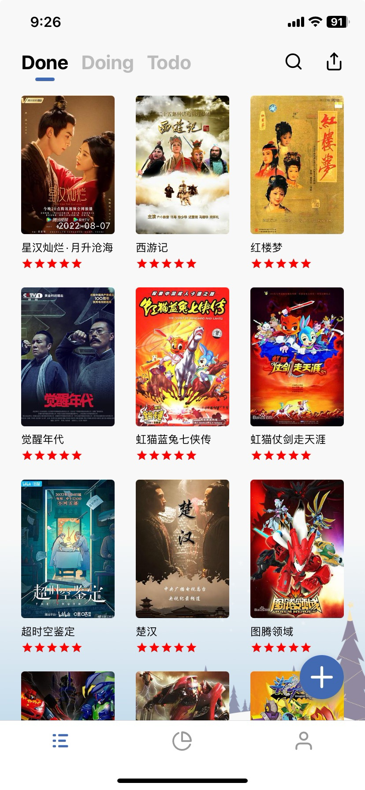
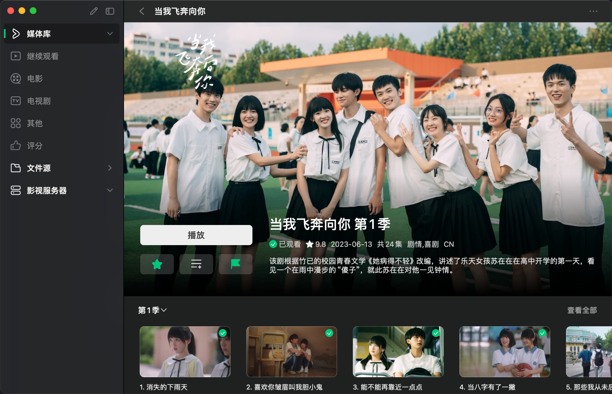

# 个体藏影阁构建

- 为什么要构建个体藏影阁
- 构建思路
- 工具
    - 已阅
    - VidHub

## 为什么要构建个体藏影阁

近期我回顾儿时看过的动画时，发现随着时间的逝去，很多动画我已经记不清自己有没有看过了。那一刻我感受到，尘封的记忆是真的化为尘灰，烟消云散了。出于对当下留念和未来回忆的需要，加上我曾经有看过不少搭建影音库的方案，实现起来不是什么困难的事情。

那么，三二一开始。

## 构建思路

### 用到的工具

1. 已阅

个人开发者开发的书影记录软件，记录片名，自动抓取豆瓣片源信息展示，支持记录个人评论、评分、清单、标签等。

2. VidHub

国产媒体播放器软件 **VidHub**，支持本地、局域网共享、云盘挂载。

3. Notion

用 Notion 来搭建观影记录，已经不是什么新鲜的方案，已经有很多人专门写过相应的文章。

详细可见其它人写的文章：利用 Notion 搭建观影记录

### 实践搭建

以找回我逝去的童年动画回忆为例，**首先**要解决的一个问题是——我忘记了童年动画我都看了什么？片名是什么？**其次**是如何判断我曾经有没有看过；**最后**是如何记录和分享它们。

解决第一个问题，并不难，我儿时主要通过电视的方式观看动画，只要查一下童年时，电视上播放动画的频道的动画列表，便可得到童年有可能看过的动画大合集。不过这么做有点太费劲了，即便得到的有可能的动画大合集，但其数量应该会很劝退，而且我无法从列表名字中判断我有没有看过，还需要一个个手动搜索确认，又多出了一个步骤，这效率是我所不能接受的。突然，这时，想起媒体平台的视频，豁然开朗，童年的流量可不小，为此已经整理过我设想的童年动画合集的媒体人，应该不会少，我只需要去主流视频平台稍稍搜索一下，顺着它们二次整理后的内容，便可“**顺藤摸瓜**”。

解决第二个问题，有了解决第一个问题的思路基础，解决第二个问题并不难，通过观看主流媒体平台的视频，一方面省去了自己寻找整理的时间，另一方面可以通过直观的画面，进行判断我有没有看过这部童年动画。通过画面大部分很容易确定，对于那些我已经记不清楚有没有看过的、画面略过已经没有感觉的，想必当时即便是有看过，也只是浮光掠影般略过，并没有留下什么印象，这样也不算童年，为了便于记录，及收集真正的童年回忆，一律采用不记录即可。

解决第三个问题，就要进入到选择记录工具的时候了，我选择的是**已阅**——由独立开发者开发的 iOS 端应用，我在 2023 年了解到这款软件的时候，它还在内测，我初次尝试了一下，体验感还是很不错的，虽然还有许多地方有 bug，不过我看到的出来开发者用心了，便直接买断了这款软件的终身早鸟价，一来支持个人开发者，二来也是为了以后我用这款软件时，免去订阅制的忧虑。已阅，除了承包记录功能外，它的分享功能做的也不错，可以说满足了所有记录书影的需求。

其实，对于记录上，已阅一款工具已经可以完全胜任了，不过人的欲望是无限的，既然已经完美解决了记录的需求，那么还会有这样一种需要——如果再过几年曾经看过的动画已经在网络上完全消失，找不到片源了，该如何再次回忆式观看呢？或者我就是需要进行离线观看？要解决这个问题，就需要对本地下载好的资源进行整理。为解决这个需求，就需要引入一个新工具——VidHub，VidHub 是一款可以根据文件名自动获取片源海报并自动整理出类似影视平台界面的展示，同时 VidHub 作为一款国人开发的软件，支持云盘挂载，只能说到这里了，不能再多说了。而 Notion 是我对外展示用到软件，我通过 Notion 的数据库画廊视图去展示最近观影情况。

至此，我已经通过我是记录童年动画的全过程，展示了如何进行思考、工具选择，到最终的解决方案——已阅记录，VidHub 观影，Notion 展示。
